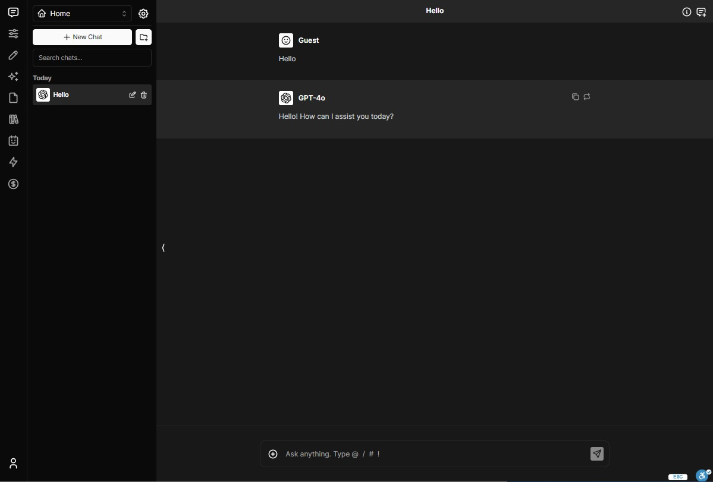

# Chatbot UI

The open-source AI chat app for everyone.



## Demo

View the [Live Demo](https://app.chatgpt.co.il/).

## Project Setup

### 1. Clone the Repo

```bash
git clone https://github.com/super9157/ChatbotUI.git
```

### 2. Install Dependencies

Open a terminal in the root directory of your local Chatbot UI repository and run:

```bash
npm install
```

### 3. Environment Variables

In your terminal at the root of your local Chatbot UI repository, run:

```bash
cp .env.example .env
```

If the environment variable is set, it will disable the input in the user settings.

### 4. Database Migration

Execute sql files located in `/supabase/migrations` directory.

This prevents issues with storage files not being deleted properly.

### 6. Run app locally

In your terminal at the root of your local Chatbot UI repository, run:

```bash
npm run dev
```

Your local instance of Chatbot UI should now be running at [http://localhost:3000](http://localhost:3000)

## Contact

Message Mckay on [Telegram](https://t.me/super9157)
